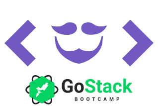

<h1 align="center">
 
GoBarber API
</h1>

An API for barber appointment and scheduling.

  
   
   
  

## Features

A Node.js API built with Express and all the latest tools and best practices in development!

- ⚡ **Express** — A web framework for Node
- 💾 **TypeORM** — An ORM for Node.js
- 🍂 **MongoDB** — document-based database
- 🔑 **Redis** — key-value data model
- ⌨️ **Yup** - Object schema validation
- 📧 **Nodemailer** - Send e-mails with Node.JS
- 💖 **Lint** — ESlint/Prettier/Editor Config

## Dependencies

- [Node.js](https://nodejs.org/en/)
- [Yarn](https://yarnpkg.com/pt-BR/docs/install)
- [Docker](https://www.docker.com/)

## Prerequisites

To run this server you will need three containers running on your machine.

To do so, you will need to run the following commands:

- `docker run --name redisbarber -p 6379:6379 -d -t redis:alpine`;
- `docker run --name mongobarber -p 27017:27017 -d -t mongo`;
- `docker run --name postgres -e POSTGRES_PASSWORD=docker -p 5433:5432 -d postgres`;

_Remember: If you restart your machine, you will need to start again the server with `docker start <container_id>`._

## Getting started

1. Clone this repo using `https://github.com/GabrielStedile999/gobarber-server`
2. Move to the appropriate directory: `cd gobarber-api`. 
3. Run `yarn` to install dependencies. 
4. Copy the `.env.example` file and rename it to `.env`. 
5. Add all the values for the environment variables. 
6. Run `yarn start` and `yarn queue` to run the servers at `http://localhost:3000`.

## Modules

This API has the following modules:

**Password Recover**

**Profile Update**

**Provider panel**

**Scheduling services**

## License

Distributed under the MIT License. See `LICENSE` for more information.

## Contact

Gabriel Stedile - gabriel.stedile9@gmail.com

Project Link: [https://github.com/GabrielStedile999/gobarber-server](https://github.com/GabrielStedile999/gobarber-server)